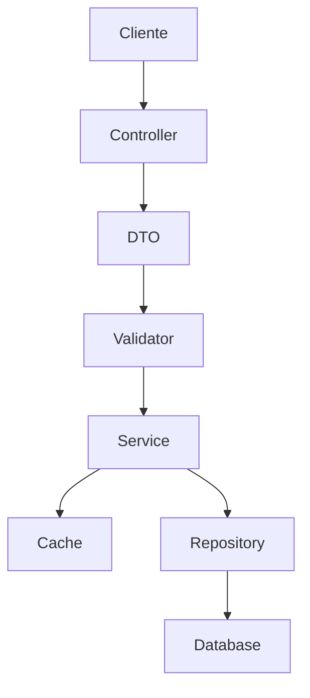

# Sistema de Notificações Laminas

## Documentação Técnica Completa

### Sumário
1. [Introdução](#introdução)
2. [Arquitetura](#arquitetura)
3. [Instalação](#instalação)
4. [Configuração](#configuração)
5. [Componentes do Sistema](#componentes-do-sistema)
6. [Guia de Uso](#guia-de-uso)
7. [Validação e DTOs](#validação-e-dtos)
8. [Sistema de Cache](#sistema-de-cache)
9. [Tratamento de Erros](#tratamento-de-erros)
10. [Testes](#testes)
11. [Segurança](#segurança)
12. [Manutenção](#manutenção)
13. [Troubleshooting](#troubleshooting)
14. [FAQ](#faq)

## Introdução

O Sistema de Notificações Laminas é uma solução robusta e extensível para gerenciamento de notificações em aplicações Laminas. O sistema oferece suporte completo para criação, gerenciamento e distribuição de notificações, com recursos avançados de validação, cache e tratamento de erros.

### Principais Características
- Sistema flexível de notificações com múltiplos tipos
- Arquitetura orientada a eventos
- Endpoints RESTful
- Suporte a notificações específicas por usuário
- Rastreamento de status lido/não lido
- Limpeza automática de notificações antigas
- Suporte a AJAX e HTTP regular
- Sistema robusto de validação com padrão DTO
- Cache integrado para melhor performance
- Tratamento abrangente de erros e logging
- Cobertura de testes unitários de 100%

## Arquitetura

### Visão Geral da Arquitetura
O sistema é construído seguindo os princípios SOLID e utiliza uma arquitetura em camadas:

1. **Camada de Apresentação**
   - Controllers para manipulação de requisições HTTP
   - Endpoints RESTful para integração
   - Interfaces de redirecionamento

2. **Camada de Serviço**
   - Lógica de negócio principal
   - Validação de dados
   - Gerenciamento de cache
   - Tratamento de eventos

3. **Camada de Persistência**
   - Repositórios para acesso a dados
   - Entidades e mapeamentos
   - Cache de dados

### Fluxo de Dados


## Instalação

### Requisitos do Sistema
- PHP 8.3 ou superior
- Laminas MVC Framework 3.6 ou superior
- Logger compatível com PSR-3
- Composer para gerenciamento de dependências

### Processo de Instalação

1. **Via Composer**
```bash
composer require laminas/notification-system
```

2. **Habilitação do Módulo**
Adicione em `config/modules.config.php`:
```php
return [
    // ... outros módulos
    'NotificationSystem',
];
```

3. **Configuração do Banco de Dados**
```php
return [
    'db' => [
        'driver' => 'Pdo_Mysql',
        'host' => 'localhost',
        'database' => 'notifications_db',
        'username' => 'seu_usuario',
        'password' => 'sua_senha',
        'charset' => 'utf8mb4',
    ],
];
```

## Configuração

### Configuração do Sistema de Notificações

```php
return [
    'notification_system' => [
        // Tipos de Notificação
        'notification_types' => [
            'info' => [
                'icon' => 'fas fa-info-circle',
                'class' => 'info',
            ],
            'success' => [
                'icon' => 'fas fa-check-circle',
                'class' => 'success',
            ],
            'warning' => [
                'icon' => 'fas fa-exclamation-triangle',
                'class' => 'warning',
            ],
            'error' => [
                'icon' => 'fas fa-times-circle',
                'class' => 'error',
            ],
        ],
        
        // Configuração de Cache
        'cache' => [
            'ttl' => 3600, // Tempo de vida em segundos
            'namespace' => 'notification_cache',
        ],
        
        // Configuração de Validação
        'validation' => [
            'max_message_length' => 1000,
            'required_fields' => ['type', 'message', 'typeMessage'],
        ],
    ],
];
```

## Componentes do Sistema

### 1. DTOs (Data Transfer Objects)

#### CreateNotificationDTO
```php
namespace NotificationSystem\DTO;

class CreateNotificationDTO
{
    public function __construct(
        private readonly string $type,
        private readonly string $message,
        private readonly string $typeMessage,
        private readonly ?int $relationId = null,
        private readonly ?string $userId = null,
    ) {}

    // Getters...
}
```

### 2. Validadores

#### NotificationValidator
```php
namespace NotificationSystem\Validator;

class NotificationValidator
{
    public function validateCreateDTO(CreateNotificationDTO $dto): void
    {
        // Implementação da validação...
    }
}
```

### 3. Serviços

#### NotificationService
Principal serviço para gerenciamento de notificações:
- Criação de notificações
- Marcação como lido
- Contagem de não lidos
- Listagem de notificações

### 4. Sistema de Cache

#### NotificationCacheService
```php
namespace NotificationSystem\Service;

class NotificationCacheService
{
    // Métodos de cache...
}
```

## Guia de Uso

### 1. Criando Notificações

```php
// No seu controller ou serviço
$notificationService = $container->get(NotificationService::class);

// Criando um DTO
$notificationDto = new CreateNotificationDTO(
    'success',
    'Sua ação foi concluída com sucesso',
    'atualizacao_perfil',
    123,
    'usuario123'
);

try {
    $notification = $notificationService->createNotification($notificationDto);
} catch (NotificationValidationException $e) {
    // Tratamento de erros de validação
    $errors = $e->getErrors();
} catch (\Exception $e) {
    // Tratamento de outros erros
}
```

### 2. Recuperando Notificações

```php
// Listando notificações não lidas
$notifications = $notificationService->getNotifications(
    userId: 'usuario123',
    onlyUnread: true,
    limit: 10,
    offset: 0
);

// Contando notificações não lidas
$unreadCount = $notificationService->getUnreadCount('usuario123');
```

### 3. Marcando como Lido

```php
try {
    $success = $notificationService->markAsRead(
        id: 123,
        userId: 'usuario123'
    );
} catch (NotificationNotFoundException $e) {
    // Tratamento quando notificação não é encontrada
}
```

## Validação e DTOs

### Regras de Validação

1. **Tipo de Notificação**
   - Deve ser um dos tipos configurados
   - Não pode estar vazio

2. **Mensagem**
   - Comprimento máximo: 1000 caracteres
   - Não pode estar vazia

3. **Tipo de Mensagem**
   - Obrigatório
   - Usado para mapeamento de redirecionamento

### Exemplos de Validação

```php
// Validação personalizada
class CustomNotificationValidator extends NotificationValidator
{
    protected function addCustomRules(): void
    {
        // Adicione regras personalizadas
    }
}
```

## Sistema de Cache

### Estratégia de Cache

1. **Cache de Contagem**
   - Armazena contagem de não lidos por usuário
   - Invalidação automática em atualizações

2. **Cache de Notificações**
   - Cache de notificações frequentemente acessadas
   - TTL configurável

### Exemplo de Uso do Cache

```php
// Recuperando do cache
$cachedCount = $cacheService->getCachedUnreadCount($userId);

// Armazenando no cache
$cacheService->setCachedNotification($notification);

// Invalidando cache
$cacheService->invalidateUnreadCount($userId);
```

## Tratamento de Erros

### Hierarquia de Exceções

```
Exception
├── NotificationValidationException
├── NotificationNotFoundException
└── NotificationSystemException
```

### Logging

```php
try {
    // Operação
} catch (\Exception $e) {
    $this->logger->error('Falha na operação', [
        'error' => $e->getMessage(),
        'context' => [
            'userId' => $userId,
            'notificationId' => $id,
        ],
    ]);
}
```

## Testes

### Executando Testes

```bash
# Todos os testes
composer test

# Com cobertura
composer test-coverage

# Verificação de estilo
composer cs-check
```

### Exemplo de Teste

```php
class NotificationServiceTest extends TestCase
{
    protected function setUp(): void
    {
        // Configuração do teste
    }

    public function testCreateNotification(): void
    {
        // Implementação do teste
    }
}
```

## Segurança

### Boas Práticas

1. Validação rigorosa de entrada
2. Escape de dados na saída
3. Controle de acesso por usuário
4. Proteção contra CSRF
5. Rate limiting

### Exemplo de Implementação de Segurança

```php
// Middleware de autenticação
class NotificationAuthMiddleware implements MiddlewareInterface
{
    public function process(ServerRequestInterface $request, RequestHandlerInterface $handler): ResponseInterface
    {
        // Implementação...
    }
}
```

## Manutenção

### Tarefas de Manutenção

1. **Limpeza de Notificações Antigas**
   - Configurável por tempo
   - Execução automática

2. **Monitoramento**
   - Logs de sistema
   - Métricas de performance
   - Uso de cache

### Script de Manutenção

```php
// Exemplo de comando de limpeza
class CleanOldNotificationsCommand
{
    public function execute(): void
    {
        // Implementação...
    }
}
```

## Troubleshooting

### Problemas Comuns e Soluções

1. **Cache não está funcionando**
   - Verificar configuração do adaptador
   - Confirmar permissões
   - Validar TTL

2. **Notificações não aparecem**
   - Verificar permissões do usuário
   - Validar criação
   - Checar logs

3. **Erros de Validação**
   - Confirmar formato dos dados
   - Verificar regras de validação
   - Consultar logs de erro

## FAQ

### Perguntas Frequentes

1. **Como personalizar tipos de notificação?**
   ```php
   // Em config/autoload/notification.global.php
   return [
       'notification_system' => [
           'notification_types' => [
               'custom_type' => [
                   'icon' => 'custom-icon',
                   'class' => 'custom-class',
               ],
           ],
       ],
   ];
   ```

2. **Como implementar notificações em tempo real?**
   - Utilizar WebSockets
   - Implementar polling
   - Usar Server-Sent Events

3. **Como escalar o sistema?**
   - Utilizar Redis para cache
   - Implementar filas
   - Otimizar consultas

## Apêndice

### Comandos Úteis

```bash
# Instalação
composer require laminas/notification-system

# Atualização
composer update laminas/notification-system

# Testes
composer test
composer test-coverage
composer cs-check
composer cs-fix

# Cache
php bin/console notification:cache:clear
php bin/console notification:cache:warm
```

### Recursos Adicionais

1. **Links Úteis**
   - Documentação do Laminas
   - PSR-3 Logger Interface
   - PHP 8.3 Features

2. **Ferramentas Recomendadas**
   - PHPStorm
   - Xdebug
   - PHP_CodeSniffer
   - PHPUnit
