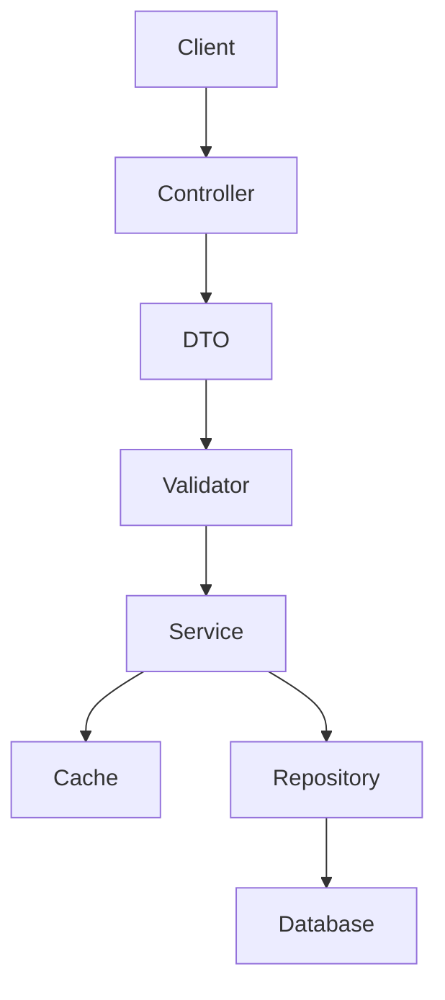

# Laminas Notification System

## Complete Technical Documentation

### Table of Contents
1. [Introduction](#introduction)
2. [Architecture](#architecture)
3. [Installation](#installation)
4. [Configuration](#configuration)
5. [System Components](#system-components)
6. [Usage Guide](#usage-guide)
7. [Validation and DTOs](#validation-and-dtos)
8. [Caching System](#caching-system)
9. [Error Handling](#error-handling)
10. [Testing](#testing)
11. [Security](#security)
12. [Maintenance](#maintenance)
13. [Troubleshooting](#troubleshooting)
14. [FAQ](#faq)

## Introduction

The Laminas Notification System is a robust and extensible solution for notification management in Laminas applications. The system provides comprehensive support for creating, managing, and distributing notifications, with advanced features for validation, caching, and error handling.

### Key Features
- Flexible notification system with multiple types
- Event-driven architecture
- RESTful endpoints
- User-specific notifications support
- Read/unread status tracking
- Automatic cleanup of old notifications
- AJAX and regular HTTP support
- Robust validation with DTO pattern
- Integrated caching for better performance
- Comprehensive error handling and logging
- 100% unit test coverage

## Architecture

### Architecture Overview
The system is built following SOLID principles and uses a layered architecture:

1. **Presentation Layer**
   - Controllers for HTTP request handling
   - RESTful endpoints for integration
   - Redirection interfaces

2. **Service Layer**
   - Core business logic
   - Data validation
   - Cache management
   - Event handling

3. **Persistence Layer**
   - Repositories for data access
   - Entities and mappings
   - Data caching

### Data Flow


## Installation

### System Requirements
- PHP 8.3 or higher
- Laminas MVC Framework 3.6 or higher
- PSR-3 compatible logger
- Composer for dependency management

### Installation Process

1. **Via Composer**
```bash
composer require laminas/notification-system
```

2. **Module Activation**
Add to `config/modules.config.php`:
```php
return [
    // ... other modules
    'NotificationSystem',
];
```

3. **Database Configuration**
```php
return [
    'db' => [
        'driver' => 'Pdo_Mysql',
        'host' => 'localhost',
        'database' => 'notifications_db',
        'username' => 'your_username',
        'password' => 'your_password',
        'charset' => 'utf8mb4',
    ],
];
```

## Configuration

### Notification System Configuration

```php
return [
    'notification_system' => [
        // Notification Types
        'notification_types' => [
            'info' => [
                'icon' => 'fas fa-info-circle',
                'class' => 'info',
            ],
            'success' => [
                'icon' => 'fas fa-check-circle',
                'class' => 'success',
            ],
            'warning' => [
                'icon' => 'fas fa-exclamation-triangle',
                'class' => 'warning',
            ],
            'error' => [
                'icon' => 'fas fa-times-circle',
                'class' => 'error',
            ],
        ],
        
        // Cache Configuration
        'cache' => [
            'ttl' => 3600, // Time to live in seconds
            'namespace' => 'notification_cache',
        ],
        
        // Validation Configuration
        'validation' => [
            'max_message_length' => 1000,
            'required_fields' => ['type', 'message', 'typeMessage'],
        ],
    ],
];
```

## System Components

### 1. DTOs (Data Transfer Objects)

#### CreateNotificationDTO
```php
namespace NotificationSystem\DTO;

class CreateNotificationDTO
{
    public function __construct(
        private readonly string $type,
        private readonly string $message,
        private readonly string $typeMessage,
        private readonly ?int $relationId = null,
        private readonly ?string $userId = null,
    ) {}

    // Getters...
}
```

### 2. Validators

#### NotificationValidator
```php
namespace NotificationSystem\Validator;

class NotificationValidator
{
    public function validateCreateDTO(CreateNotificationDTO $dto): void
    {
        // Validation implementation...
    }
}
```

### 3. Services

#### NotificationService
Main service for notification management:
- Creating notifications
- Marking as read
- Unread counting
- Notification listing

### 4. Caching System

#### NotificationCacheService
```php
namespace NotificationSystem\Service;

class NotificationCacheService
{
    // Cache methods...
}
```

## Usage Guide

### 1. Creating Notifications

```php
// In your controller or service
$notificationService = $container->get(NotificationService::class);

// Creating a DTO
$notificationDto = new CreateNotificationDTO(
    'success',
    'Your action was completed successfully',
    'profile_update',
    123,
    'user123'
);

try {
    $notification = $notificationService->createNotification($notificationDto);
} catch (NotificationValidationException $e) {
    // Handle validation errors
    $errors = $e->getErrors();
} catch (\Exception $e) {
    // Handle other errors
}
```

### 2. Retrieving Notifications

```php
// Listing unread notifications
$notifications = $notificationService->getNotifications(
    userId: 'user123',
    onlyUnread: true,
    limit: 10,
    offset: 0
);

// Counting unread notifications
$unreadCount = $notificationService->getUnreadCount('user123');
```

### 3. Marking as Read

```php
try {
    $success = $notificationService->markAsRead(
        id: 123,
        userId: 'user123'
    );
} catch (NotificationNotFoundException $e) {
    // Handle when notification is not found
}
```

## Validation and DTOs

### Validation Rules

1. **Notification Type**
   - Must be one of the configured types
   - Cannot be empty

2. **Message**
   - Maximum length: 1000 characters
   - Cannot be empty

3. **Message Type**
   - Required
   - Used for redirect mapping

### Validation Examples

```php
// Custom validation
class CustomNotificationValidator extends NotificationValidator
{
    protected function addCustomRules(): void
    {
        // Add custom rules
    }
}
```

## Caching System

### Caching Strategy

1. **Count Caching**
   - Stores unread count per user
   - Automatic invalidation on updates

2. **Notification Caching**
   - Caches frequently accessed notifications
   - Configurable TTL

### Cache Usage Example

```php
// Retrieving from cache
$cachedCount = $cacheService->getCachedUnreadCount($userId);

// Storing in cache
$cacheService->setCachedNotification($notification);

// Invalidating cache
$cacheService->invalidateUnreadCount($userId);
```

## Error Handling

### Exception Hierarchy

```
Exception
├── NotificationValidationException
├── NotificationNotFoundException
└── NotificationSystemException
```

### Logging

```php
try {
    // Operation
} catch (\Exception $e) {
    $this->logger->error('Operation failed', [
        'error' => $e->getMessage(),
        'context' => [
            'userId' => $userId,
            'notificationId' => $id,
        ],
    ]);
}
```

## Testing

### Running Tests

```bash
# All tests
composer test

# With coverage
composer test-coverage

# Style check
composer cs-check
```

### Test Example

```php
class NotificationServiceTest extends TestCase
{
    protected function setUp(): void
    {
        // Test setup
    }

    public function testCreateNotification(): void
    {
        // Test implementation
    }
}
```

## Security

### Best Practices

1. Strict input validation
2. Output escaping
3. User-based access control
4. CSRF protection
5. Rate limiting

### Security Implementation Example

```php
// Authentication middleware
class NotificationAuthMiddleware implements MiddlewareInterface
{
    public function process(ServerRequestInterface $request, RequestHandlerInterface $handler): ResponseInterface
    {
        // Implementation...
    }
}
```

## Maintenance

### Maintenance Tasks

1. **Old Notification Cleanup**
   - Configurable by time
   - Automatic execution

2. **Monitoring**
   - System logs
   - Performance metrics
   - Cache usage

### Maintenance Script

```php
// Cleanup command example
class CleanOldNotificationsCommand
{
    public function execute(): void
    {
        // Implementation...
    }
}
```

## Troubleshooting

### Common Issues and Solutions

1. **Cache Not Working**
   - Check adapter configuration
   - Verify permissions
   - Validate TTL

2. **Notifications Not Appearing**
   - Check user permissions
   - Validate creation
   - Check logs

3. **Validation Errors**
   - Confirm data format
   - Check validation rules
   - Consult error logs

## FAQ

### Frequently Asked Questions

1. **How to customize notification types?**
   ```php
   // In config/autoload/notification.global.php
   return [
       'notification_system' => [
           'notification_types' => [
               'custom_type' => [
                   'icon' => 'custom-icon',
                   'class' => 'custom-class',
               ],
           ],
       ],
   ];
   ```

2. **How to implement real-time notifications?**
   - Use WebSockets
   - Implement polling
   - Use Server-Sent Events

3. **How to scale the system?**
   - Use Redis for caching
   - Implement queues
   - Optimize queries

## Appendix

### Useful Commands

```bash
# Installation
composer require laminas/notification-system

# Update
composer update laminas/notification-system

# Tests
composer test
composer test-coverage
composer cs-check
composer cs-fix

# Cache
php bin/console notification:cache:clear
php bin/console notification:cache:warm
```

### Additional Resources

1. **Useful Links**
   - Laminas Documentation
   - PSR-3 Logger Interface
   - PHP 8.3 Features

2. **Recommended Tools**
   - PHPStorm
   - Xdebug
   - PHP_CodeSniffer
   - PHPUnit
